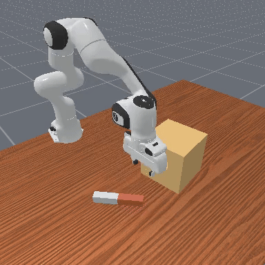
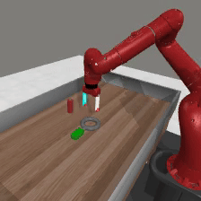
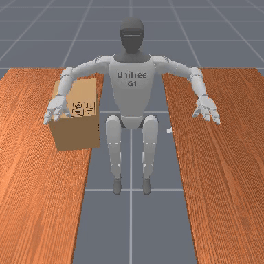
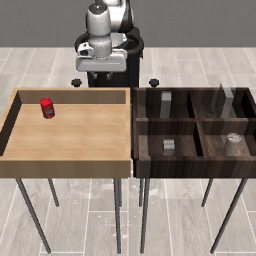

<h1>DEMO<sup>3</sup></span></h1>

Official implementation of

[DEMO<sup>3</sup>: Demonstration-Augmented Reward, Policy, and World Model Learning](https://sites.google.com/view/icml2025demo3) by

[Adrià López Escoriza](https://adrialopezescoriza.github.io), [Nicklas Hansen](https://nicklashansen.github.io), [Stone Tao](https://www.stoneztao.com/), [Tongzhou Mu](https://cseweb.ucsd.edu/~t3mu/), [Hao Su](https://cseweb.ucsd.edu/~haosu) (UC San Diego)</br>

<!-- </br> -->

[[Website]](https://sites.google.com/view/icml2025demo3) [[Paper]](https://arxiv.org/abs/2310.16828)

----

## Overview

**DEMO<sup>3</sup>** is a a framework that incorporates multi-stage dense reward learning, a bi-phasic training scheme, and world model learning into a carefully designed demonstration-augmented RL algorithm. Our evaluations demonstrate that our method improves data-efficiency by an average of 40% and by 70% on particularly difficult tasks compared to state-of-the-art approaches. We validate this across 16 sparse-reward tasks spanning four domains, including challenging humanoid visual control tasks using as few as five demonstrations.. 

<!-- <br/> -->

This repository contains code for training and evaluating **DEMO<sup>3</sup>**, MoDem and TD-MPC2 agents. We additionally open-source **16+** multi-stage tasks across 4 task domains: [Meta-World](https://meta-world.github.io/), [ManiSkill3](https://maniskill.readthedocs.io/en/latest/#), [RoboSuite](https://robosuite.ai/) and [BiGym](https://github.com/chernyadev/bigym). Our codebase supports both state and pixel observations. We hope that this repository will serve as a useful community resource for future research on demonstration-augmented RL.

----

## Getting started

You will need a machine with a GPU and at least 12 GB of RAM for state-based RL with DEMO<sup>3</sup>, and 32 GB of RAM for pixel-based observations. A GPU with at least 16 GB of memory is recommended for pixel-based RL.

We provide a `Dockerfile` for easy installation. You can build the docker image by running

```
cd docker && docker build . -t <user>/DEMO3:1.0.0
```

This docker image contains all dependencies needed for running ManiSkill3, Meta-World, Robosuite and BiGym experiments.

If you prefer to install dependencies manually, start by installing dependencies via `conda` by running the following command:

```
conda env create -f docker/environment.yaml
```

The `environment.yaml` file installs dependencies required for training on DMControl tasks. Other domains can be installed by following the instructions in `environment.yaml`.

See `docker/Dockerfile` for installation instructions if you do not already have MuJoCo 2.1.0 installed. MyoSuite requires `gym==0.13.0` which is incompatible with Meta-World and ManiSkill2. Install separately with `pip install myosuite` if desired. Depending on your existing system packages, you may need to install other dependencies. See `docker/Dockerfile` for a list of recommended system packages.

----

## Supported tasks

This codebase currently supports **104** continuous control tasks from **DMControl**, **Meta-World**, **ManiSkill2**, and **MyoSuite**. Specifically, it supports 39 tasks from DMControl (including 11 custom tasks), 50 tasks from Meta-World, 5 tasks from ManiSkill2, and 10 tasks from MyoSuite, and covers all tasks used in the paper. See below table for expected name formatting for each task domain:

| domain | task
| --- | --- |
| dmcontrol | dog-run
| dmcontrol | cheetah-run-backwards
| metaworld | mw-assembly
| metaworld | mw-pick-place-wall
| maniskill | pick-cube
| maniskill | pick-ycb
| myosuite  | myo-key-turn
| myosuite  | myo-key-turn-hard

which can be run by specifying the `task` argument for `evaluation.py`. Multi-task training and evaluation is specified by setting `task=mt80` or `task=mt30` for the 80-task and 30-task sets, respectively.

**As of Dec 27, 2023 the TD-MPC2 codebase also supports pixel observations for DMControl tasks**; use argument `obs=rgb` if you wish to train visual policies.


## Example usage

We provide examples on how to evaluate our provided TD-MPC**2** checkpoints, as well as how to train your own TD-MPC**2** agents, below.

### Evaluation

See below examples on how to evaluate downloaded single-task and multi-task checkpoints.

```
$ python evaluate.py task=mt80 model_size=48 checkpoint=/path/to/mt80-48M.pt
$ python evaluate.py task=mt30 model_size=317 checkpoint=/path/to/mt30-317M.pt
$ python evaluate.py task=dog-run checkpoint=/path/to/dog-1.pt save_video=true
```

All single-task checkpoints expect `model_size=5`. Multi-task checkpoints are available in multiple model sizes. Available arguments are `model_size={1, 5, 19, 48, 317}`. Note that single-task evaluation of multi-task checkpoints is currently not supported. See `config.yaml` for a full list of arguments.

### Training

See below examples on how to train TD-MPC**2** on a single task (online RL) and on multi-task datasets (offline RL). We recommend configuring [Weights and Biases](https://wandb.ai) (`wandb`) in `config.yaml` to track training progress.

```
$ python train.py task=mt80 model_size=48 batch_size=1024
$ python train.py task=mt30 model_size=317 batch_size=1024
$ python train.py task=dog-run steps=7000000
$ python train.py task=walker-walk obs=rgb
```

We recommend using default hyperparameters for single-task online RL, including the default model size of 5M parameters (`model_size=5`). Multi-task offline RL benefits from a larger model size, but larger models are also increasingly costly to train and evaluate. Available arguments are `model_size={1, 5, 19, 48, 317}`. See `config.yaml` for a full list of arguments.

**As of Jan 7, 2024 the TD-MPC2 codebase also supports multi-GPU training for multi-task offline RL experiments**; use branch `distributed` and argument `world_size=N` to train on `N` GPUs. We cannot guarantee that distributed training will yield the same results, but they appear to be similar based on our limited testing.

----

## Acknowledgements
This codebase is built upon the [TD-MPC2](https://github.com/nicklashansen/tdmpc2) repository.

----

## Contributing

You are very welcome to contribute to this project. Feel free to open an issue or pull request if you have any suggestions or bug reports, but please review our [guidelines](CONTRIBUTING.md) first. Our goal is to build a codebase that can easily be extended to new environments and tasks, and we would love to hear about your experience!

----

## License

This project is licensed under the MIT License - see the `LICENSE` file for details. Note that the repository relies on third-party code, which is subject to their respective licenses.
